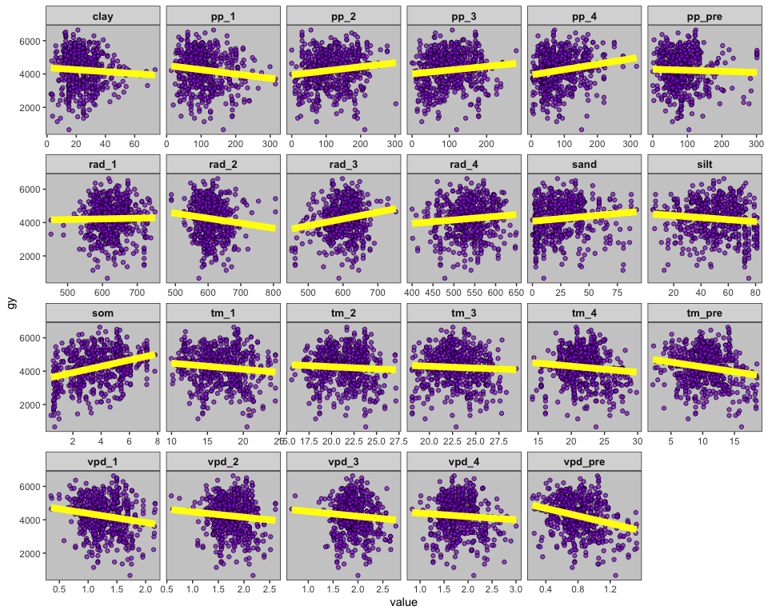
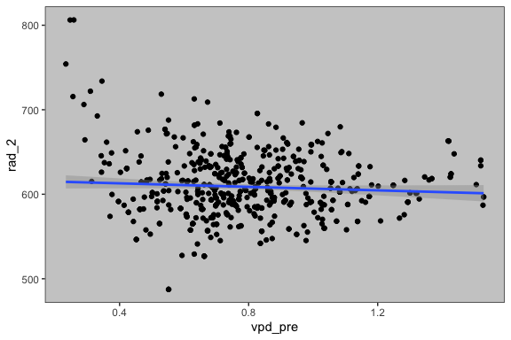

day1\_complete
================

-   [1 Quick initial notes](#quick-initial-notes)
-   [2 Agenda](#agenda)
-   [3 Intro](#intro)
    -   [3.1 What is multivariate
        analysis?](#what-is-multivariate-analysis)
    -   [3.2 When to use multivariate?](#when-to-use-multivariate)
    -   [3.3 Main types of multivariate](#main-types-of-multivariate)
    -   [3.4 A few ways to characterize multivariate
        analysis](#a-few-ways-to-characterize-multivariate-analysis)
-   [4 Setup](#setup)
-   [5 Wrangling](#wrangling)
-   [6 EDA](#eda)
-   [7 Multicollinearity](#multicollinearity)
    -   [7.1 Concepts](#concepts)
    -   [7.2 Applied example](#applied-example)
    -   [7.3 Dealing with
        multicollinearity](#dealing-with-multicollinearity)
-   [8 PCA](#pca)
-   [9 k-means](#k-means)
-   [10 Exercise](#exercise)
-   [11 Summary](#summary)

# 1 Quick initial notes

-   Let us know in the chat if you are having issues installing the
    packages.

-   The workshop today will run from 2h, and it will be recorded and
    made available later on the AGSA youtube channel.

-   The complete script will be made available later tonight on the same
    GitHug page shared via email earlier.

-   This is an advanced workshop and assumes you already have knowledge
    about:

    -   RStudio projects  
    -   Rmarkdown files  
    -   dplyr, ggplot, pipe operator

If you are not familiar with these topics, you will likely get lost.  
Unfortunately, we won’t have time to troubleshoot in those cases.

We have covered these topics in previous workshops that are available on
the AGSA youtube account.

Having said that, please feel free to post questions related to today’s
topics on the chat, and Carlos will let me know of them.

Before we begin:

-   Click on the TOC button on the side to help move in the code  
-   Chunks:
    -   In the chunks we run code as if it were the console.  
    -   You can write your own notes outside the chunks.  
    -   To run a piece of code, place your cursor anywhere in the chunk
        and press **command (or control) + Enter**.  
    -   To run entire chunk, press the play button on the chunk.

# 2 Agenda

Today we are exploring the following topics:

-   What is and when to use multivariate analysis?
-   Different types of multivariate analysis
-   Import a soybean yield dataset with multiple variables to be
    analyzed
-   Understand what is multicollinearity, its effects, implications, and
    remedies  
-   Run principal component analysis (PCA) for dimensionality reduction
-   Run k-means for clustering

# 3 Intro

## 3.1 What is multivariate analysis?

Most common: multiple Xs (predictors)

               y ~ x1 + x2 + .... xn  
               yield ~ precip + temp + som + hybrid  

Perhaps multiple Xs (predictors) without a Y (outcome)

              ~ x1 + x2 + .... xn

While some can have multiple Ys (outcomes)

               y1 + y2 ~ x1 + x2 (MANOVA)  
               yield + biomass ~ precip + temp  

## 3.2 When to use multivariate?

When multiple predictors can be used to explain an outcome.  
When multiple predictors can be used to create data-driven groups
(clusters).

Commonly not a “designed experiment” analysis, but an exploratory
relationship approach.

## 3.3 Main types of multivariate

-   Dimensionality reduction
    -   **Principal component analysis (PCA)**
    -   Principal coordinate analysis (PCoA)
    -   Factor analysis
-   Clustering
    -   **k-means**, c-means, x-means  
    -   Non-numerical multidimensional scaling
    -   nearest neighbor
-   Relationship between variables / Prediction
    -   Multiple linear regression/stepwise regression
    -   **Random forest**
    -   **Conditional inference tree**

## 3.4 A few ways to characterize multivariate analysis

-   Based on analysis goal:
    -   Decrease number of dimensions  
    -   Create clusters  
    -   Establish significant relationships among multiple predictors
        and an outcome.
-   Based on Y (outcome) existence:
    -   Supervised
    -   Unsupervised
-   If Y exists, based on its type:
    -   Categorical: classification
    -   Numerical: regression

# 4 Setup

``` r
#install.packages("easypackages")
library(easypackages)

packages("janitor") # clean column names
packages("tidyverse") # wrangling and general plotting
packages("ggcorrplot") # exploratory correlation plot
packages("broom") # extracting model info as data frame
packages("car") # vif
packages("factoextra") # multivariate plotting

# Setting plotting theme
theme_set(theme_bw()+
            theme(panel.background = element_rect(fill="gray80"),
                  panel.grid = element_blank(),
                  strip.text = element_text(face = "bold", size=10)))
```

``` r
mvadf <- read_csv("../data/data_R_MVA.csv")
```

# 5 Wrangling

``` r
mvadf
```

    ## # A tibble: 600 x 41
    ##       GY TILL  FUNG  INOC    SOM  Clay  Silt  Sand Pp_pre  Pp_1  Pp_2  Pp_3
    ##    <dbl> <chr> <chr> <chr> <dbl> <dbl> <dbl> <dbl>  <dbl> <dbl> <dbl> <dbl>
    ##  1  5682 Y     X1    Y     2.94   41.4  56.8   1.8   50.0 127.  111.   50.6
    ##  2  2791 N     X1    Y     0.920   2.7  21.4  75.9   69.8 148.   56.4 138. 
    ##  3  4113 N     NF    N     2.92   15    65    20    122.  122.   71.6  92.1
    ##  4  4850 N     X1    Y     4.81   12.4  45    42.6  101.  189.  186.   68.7
    ##  5  5886 N     NF    N     3.90   16    53.7  30.3  148.  104.   87.9 126. 
    ##  6  3397 Y     NF    N     2.52   38.3  55.7   6    109.   25.1  41.4 119. 
    ##  7  3258 Y     X1    N     2.46   15    81     4     38   102.   83.8 131. 
    ##  8  4533 Y     X1    N     4.72   30.4  65.4   4.2   35.4 102.   94.3 120. 
    ##  9  5567 N     X1    Y     5.10   12.7  51.4  35.9  114.  108.  113.  135. 
    ## 10  5280 Y     X1    Y     5.11   12.8  49.2  38    122.   61.2  30.0 170. 
    ## # … with 590 more rows, and 29 more variables: Pp_4 <dbl>, SDI_pre <dbl>,
    ## #   SDI_1 <dbl>, SDI_2 <dbl>, SDI_3 <dbl>, SDI_4 <dbl>, AWDR_pre <dbl>,
    ## #   AWDR_1 <dbl>, AWDR_2 <dbl>, AWDR_3 <dbl>, AWDR_4 <dbl>, Tm_pre <dbl>,
    ## #   Tm_1 <dbl>, Tm_2 <dbl>, Tm_3 <dbl>, Tm_4 <dbl>, Rad_1 <dbl>, Rad_2 <dbl>,
    ## #   Rad_3 <dbl>, Rad_4 <dbl>, vpd_pre <dbl>, vpd_1 <dbl>, vpd_2 <dbl>,
    ## #   vpd_3 <dbl>, vpd_4 <dbl>, Q_1 <dbl>, Q_2 <dbl>, Q_3 <dbl>, Q_4 <dbl>

The data set contains categorical and numerical columns.

``` r
mvadf %>%
  summary()
```

    ##        GY           TILL               FUNG               INOC          
    ##  Min.   : 659   Length:600         Length:600         Length:600        
    ##  1st Qu.:3576   Class :character   Class :character   Class :character  
    ##  Median :4343   Mode  :character   Mode  :character   Mode  :character  
    ##  Mean   :4231                                                           
    ##  3rd Qu.:4983                                                           
    ##  Max.   :6635                                                           
    ##       SOM              Clay            Silt            Sand      
    ##  Min.   :0.4516   Min.   : 2.70   Min.   : 4.70   Min.   : 0.00  
    ##  1st Qu.:2.4444   1st Qu.:16.48   1st Qu.:39.00   1st Qu.: 7.00  
    ##  Median :3.5550   Median :22.80   Median :51.80   Median :20.00  
    ##  Mean   :3.6841   Mean   :24.35   Mean   :51.21   Mean   :24.44  
    ##  3rd Qu.:5.1201   3rd Qu.:31.40   3rd Qu.:65.00   3rd Qu.:35.90  
    ##  Max.   :7.8128   Max.   :74.00   Max.   :81.00   Max.   :92.00  
    ##      Pp_pre            Pp_1             Pp_2             Pp_3       
    ##  Min.   :  0.42   Min.   : 13.68   Min.   :  0.00   Min.   :  0.00  
    ##  1st Qu.: 54.04   1st Qu.: 74.04   1st Qu.: 74.77   1st Qu.: 59.18  
    ##  Median : 80.24   Median :102.17   Median :113.25   Median : 94.35  
    ##  Mean   : 86.70   Mean   :109.17   Mean   :117.35   Mean   :100.31  
    ##  3rd Qu.:108.98   3rd Qu.:132.54   3rd Qu.:158.19   3rd Qu.:137.61  
    ##  Max.   :301.26   Max.   :315.32   Max.   :302.46   Max.   :279.45  
    ##       Pp_4           SDI_pre           SDI_1             SDI_2       
    ##  Min.   :  3.68   Min.   :0.0000   Min.   :0.06815   Min.   :0.0000  
    ##  1st Qu.: 46.47   1st Qu.:0.4937   1st Qu.:0.54704   1st Qu.:0.5218  
    ##  Median : 77.40   Median :0.5531   Median :0.61427   Median :0.5992  
    ##  Mean   : 89.33   Mean   :0.5521   Mean   :0.60043   Mean   :0.5777  
    ##  3rd Qu.:121.61   3rd Qu.:0.6203   3rd Qu.:0.66141   3rd Qu.:0.6701  
    ##  Max.   :318.33   Max.   :0.7890   Max.   :0.79755   Max.   :0.8046  
    ##      SDI_3            SDI_4           AWDR_pre          AWDR_1       
    ##  Min.   :0.0000   Min.   :0.0000   Min.   :  0.00   Min.   :  2.624  
    ##  1st Qu.:0.4434   1st Qu.:0.4141   1st Qu.: 27.96   1st Qu.: 42.982  
    ##  Median :0.5347   Median :0.5356   Median : 42.77   Median : 62.029  
    ##  Mean   :0.5209   Mean   :0.5046   Mean   : 50.06   Mean   : 67.292  
    ##  3rd Qu.:0.6215   3rd Qu.:0.6081   3rd Qu.: 63.98   3rd Qu.: 84.173  
    ##  Max.   :0.8215   Max.   :0.7605   Max.   :191.44   Max.   :230.971  
    ##      AWDR_2           AWDR_3           AWDR_4           Tm_pre      
    ##  Min.   :  0.00   Min.   :  0.00   Min.   :  0.00   Min.   : 2.148  
    ##  1st Qu.: 40.58   1st Qu.: 26.11   1st Qu.: 19.63   1st Qu.: 8.333  
    ##  Median : 70.78   Median : 50.47   Median : 41.87   Median :10.205  
    ##  Mean   : 71.48   Mean   : 57.16   Mean   : 50.06   Mean   :10.381  
    ##  3rd Qu.: 99.18   3rd Qu.: 82.05   3rd Qu.: 70.76   3rd Qu.:12.361  
    ##  Max.   :222.33   Max.   :210.24   Max.   :211.17   Max.   :18.534  
    ##       Tm_1             Tm_2            Tm_3            Tm_4      
    ##  Min.   : 9.974   Min.   :15.57   Min.   :18.14   Min.   :14.14  
    ##  1st Qu.:14.462   1st Qu.:19.60   1st Qu.:21.23   1st Qu.:19.97  
    ##  Median :16.612   Median :21.56   Median :22.58   Median :21.81  
    ##  Mean   :16.720   Mean   :21.32   Mean   :22.82   Mean   :21.86  
    ##  3rd Qu.:19.072   3rd Qu.:23.01   3rd Qu.:24.38   3rd Qu.:23.45  
    ##  Max.   :24.473   Max.   :27.15   Max.   :29.36   Max.   :29.84  
    ##      Rad_1           Rad_2           Rad_3           Rad_4      
    ##  Min.   :452.2   Min.   :487.5   Min.   :452.6   Min.   :399.9  
    ##  1st Qu.:595.7   1st Qu.:585.4   1st Qu.:579.2   1st Qu.:509.3  
    ##  Median :620.2   Median :603.5   Median :607.3   Median :536.8  
    ##  Mean   :625.1   Mean   :608.7   Mean   :602.9   Mean   :534.3  
    ##  3rd Qu.:654.3   3rd Qu.:630.5   3rd Qu.:630.8   3rd Qu.:562.6  
    ##  Max.   :751.4   Max.   :806.3   Max.   :751.5   Max.   :649.3  
    ##     vpd_pre           vpd_1            vpd_2            vpd_3       
    ##  Min.   :0.2335   Min.   :0.3537   Min.   :0.5878   Min.   :0.6675  
    ##  1st Qu.:0.6498   1st Qu.:1.0461   1st Qu.:1.5494   1st Qu.:1.7392  
    ##  Median :0.7675   Median :1.2377   Median :1.7562   Median :1.8985  
    ##  Mean   :0.8004   Mean   :1.2713   Mean   :1.7549   Mean   :1.9203  
    ##  3rd Qu.:0.9462   3rd Qu.:1.4974   3rd Qu.:1.9674   3rd Qu.:2.0759  
    ##  Max.   :1.5283   Max.   :2.1647   Max.   :2.6117   Max.   :2.7616  
    ##      vpd_4             Q_1              Q_2              Q_3        
    ##  Min.   :0.8327   Min.   :0.4226   Min.   :0.3647   Min.   :0.3294  
    ##  1st Qu.:1.5818   1st Qu.:0.6227   1st Qu.:0.4805   1st Qu.:0.4409  
    ##  Median :1.7942   Median :0.7712   Median :0.5334   Median :0.4872  
    ##  Mean   :1.8190   Mean   :0.8175   Mean   :0.5482   Mean   :0.4899  
    ##  3rd Qu.:2.0447   3rd Qu.:0.9571   3rd Qu.:0.6091   3rd Qu.:0.5340  
    ##  Max.   :3.0036   Max.   :2.1137   Max.   :0.9574   Max.   :0.6882  
    ##       Q_4        
    ##  Min.   :0.3031  
    ##  1st Qu.:0.4031  
    ##  Median :0.4518  
    ##  Mean   :0.4644  
    ##  3rd Qu.:0.5235  
    ##  Max.   :0.6975

Let’s transform character variables into factor,

AND

select some numerical variables to continue our analysis (precip,
temperature, radiation, and vapor pressure deficit).

``` r
mvadf_w <- mvadf %>%
  clean_names() %>%
  mutate(across(where(is.character), factor)) %>%
  dplyr::select(gy:sand, starts_with(c("pp_","tm_","rad_","vpd_")))

mvadf_w
```

    ## # A tibble: 600 x 27
    ##       gy till  fung  inoc    som  clay  silt  sand pp_pre  pp_1  pp_2  pp_3
    ##    <dbl> <fct> <fct> <fct> <dbl> <dbl> <dbl> <dbl>  <dbl> <dbl> <dbl> <dbl>
    ##  1  5682 Y     X1    Y     2.94   41.4  56.8   1.8   50.0 127.  111.   50.6
    ##  2  2791 N     X1    Y     0.920   2.7  21.4  75.9   69.8 148.   56.4 138. 
    ##  3  4113 N     NF    N     2.92   15    65    20    122.  122.   71.6  92.1
    ##  4  4850 N     X1    Y     4.81   12.4  45    42.6  101.  189.  186.   68.7
    ##  5  5886 N     NF    N     3.90   16    53.7  30.3  148.  104.   87.9 126. 
    ##  6  3397 Y     NF    N     2.52   38.3  55.7   6    109.   25.1  41.4 119. 
    ##  7  3258 Y     X1    N     2.46   15    81     4     38   102.   83.8 131. 
    ##  8  4533 Y     X1    N     4.72   30.4  65.4   4.2   35.4 102.   94.3 120. 
    ##  9  5567 N     X1    Y     5.10   12.7  51.4  35.9  114.  108.  113.  135. 
    ## 10  5280 Y     X1    Y     5.11   12.8  49.2  38    122.   61.2  30.0 170. 
    ## # … with 590 more rows, and 15 more variables: pp_4 <dbl>, tm_pre <dbl>,
    ## #   tm_1 <dbl>, tm_2 <dbl>, tm_3 <dbl>, tm_4 <dbl>, rad_1 <dbl>, rad_2 <dbl>,
    ## #   rad_3 <dbl>, rad_4 <dbl>, vpd_pre <dbl>, vpd_1 <dbl>, vpd_2 <dbl>,
    ## #   vpd_3 <dbl>, vpd_4 <dbl>

# 6 EDA

How are variables related? Any strong correlations that we should watch
out for?

``` r
# Estimating significance
p.mat <-  mvadf_w %>%
  dplyr::select(where(is.numeric)) %>%
  cor_pmat()

mvadf_w %>%
  dplyr::select(where(is.numeric)) %>%
  cor() %>%
  ggcorrplot(hc.order = TRUE,
             type = "lower", 
             p.mat = p.mat, 
             insig = "blank",
             lab= TRUE)
```

<!-- -->

How do variables relate to grain yield in a bivariate relationship?

``` r
mvadf_w %>%
  dplyr::select(where(is.numeric)) %>%
  pivot_longer(cols=!gy) %>%
  ggplot(aes(x=value, y=gy))+
  geom_point(shape=21, alpha=.7, fill="purple")+
  geom_smooth(method="lm", se=F, color="yellow", size=3)+
  facet_wrap(~name, scales = "free_x", ncol=6)+
  ggsave("../output/gyvsall.png", width = 15, height = 15)
```

<!-- -->

# 7 Multicollinearity

## 7.1 Concepts

Multicollinearity definition: more than two explanatory variables in a
multiple regression model are highly linearly related.

Multicollinearity is an issue because:

-   Model estimates magnitude and direction (+ or -) can change for
    multicollinear variables compared to a non-multicollinear model.

-   Model estimates standard error are inflated, directly affecting
    p-values, estimate significance, and power.

## 7.2 Applied example

Let’s select a few variables to run some tests.  
Two uncorrelated variables:

``` r
mvadf_w %>%
  ggplot(aes(x=vpd_pre, y=rad_2))+
  geom_point()+
  geom_smooth(method="lm")
```

<!-- -->

Two correlated variables:

``` r
mvadf_w %>%
  ggplot(aes(x=vpd_pre, y=tm_pre))+
  geom_point()+
  geom_smooth(method="lm")
```

<!-- -->

Now let’s fit some models with one or two uncorrelated and correlated
variables explaining yield and see what happens.

``` r
lm_vpd <- lm(gy ~ vpd_pre,
   data=mvadf_w) %>%
  tidy() %>%
  filter(term!="(Intercept)") %>%
  mutate(mod="lm_vpd")

lm_vpd
```

    ## # A tibble: 1 x 6
    ##   term    estimate std.error statistic  p.value mod   
    ##   <chr>      <dbl>     <dbl>     <dbl>    <dbl> <chr> 
    ## 1 vpd_pre   -1125.      169.     -6.64 6.96e-11 lm_vpd

``` r
lm_tm <- lm(gy ~ tm_pre,
   data=mvadf_w) %>%
  tidy() %>%
  filter(term!="(Intercept)") %>%
  mutate(mod="lm_tm")

lm_tm
```

    ## # A tibble: 1 x 6
    ##   term   estimate std.error statistic   p.value mod  
    ##   <chr>     <dbl>     <dbl>     <dbl>     <dbl> <chr>
    ## 1 tm_pre    -57.1      12.9     -4.42 0.0000116 lm_tm

``` r
lm_vpd.rad <- lm(gy ~ vpd_pre + rad_2,
   data=mvadf_w) %>%
  tidy() %>%
  filter(term!="(Intercept)") %>%
  mutate(mod="lm_2var.uncor")

lm_vpd.rad
```

    ## # A tibble: 2 x 6
    ##   term    estimate std.error statistic  p.value mod          
    ##   <chr>      <dbl>     <dbl>     <dbl>    <dbl> <chr>        
    ## 1 vpd_pre -1161.      168.       -6.89 1.39e-11 lm_2var.uncor
    ## 2 rad_2      -3.45      1.06     -3.24 1.28e- 3 lm_2var.uncor

``` r
lm_vpd.tm <- lm(gy ~ vpd_pre + tm_pre,
   data=mvadf_w) %>%
  tidy() %>%
  filter(term!="(Intercept)") %>%
  mutate(mod="lm_2var.cor")

lm_vpd.tm
```

    ## # A tibble: 2 x 6
    ##   term    estimate std.error statistic     p.value mod        
    ##   <chr>      <dbl>     <dbl>     <dbl>       <dbl> <chr>      
    ## 1 vpd_pre  -1510.      294.      -5.14 0.000000374 lm_2var.cor
    ## 2 tm_pre      35.3      22.0      1.60 0.109       lm_2var.cor

``` r
lm_vpd %>%
  bind_rows(lm_tm, 
            lm_vpd.rad,
            lm_vpd.tm) %>%
  mutate(mod=factor(mod,
                    levels=c("lm_vpd",
                             "lm_tm",
                             "lm_2var.uncor",
                             "lm_2var.cor"))) %>%
    filter(term!="rad_2") %>%
  ggplot(aes(x=mod))+
  geom_pointrange(aes(y=estimate,
    ymin=estimate-std.error,
                      ymax=estimate+std.error))+
  scale_x_discrete(guide = guide_axis(n.dodge = 2))+
  facet_wrap(~term, scales = "free_y")
```

<!-- -->

What has happened with tm\_pre and vpd\_pre estimates and standard error
when modeled i) alone, or with another uncorrelated variable vs. ii)
with another correlated variable?

Let’s check the variance inflation factor (VIF) of both uncorrelated and
correlated models

``` r
# Uncorrelated
vif(lm(gy ~ vpd_pre + rad_2,
   data=mvadf_w)) 
```

    ##  vpd_pre    rad_2 
    ## 1.004348 1.004348

``` r
# Correlated
vif(lm(gy ~ vpd_pre + tm_pre,
   data=mvadf_w))
```

    ##  vpd_pre   tm_pre 
    ## 3.020163 3.020163

VIF values range from 1 to positive infinite.  
General rule of thumb:

-   VIF \~ 1: no multicollinearity  
-   VIF between 1 and 5: moderate multicollinearity  
-   VIF &gt; 5: severe multicollinearity

## 7.3 Dealing with multicollinearity

So what now?  
How can we deal with correlated variables in a multivariate approach?  
Options:

-   Dimensionality reduction
    -   By hand  
    -   By math
-   Algorithm that handles multicollinearity
    -   Variable selection  
    -   Multivariate by ensembling multiple bivariates

Many multivariate approaches deal with some sort of
similarity/dissimilarity measure among predictors.

In those cases, predictors with vastly different scales (e.g. SOM from 0
to 7 vs precipitation from 0 to 300) need to be normalized so
measurement scale does not affect variable importance.

Thus, our numerical predictor variables need to be normalized (center
and scale) before starting our multivariate analysis.

Some analysis do the normalization for you (like PCA), and others don’t
(like k-means), so need to be aware of this to ensure data is
normalized.

Since both PCA and k-means only take numerical variables, let’s select
them now.

``` r
mvadf_wn <- mvadf_w %>%
  dplyr::select(where(is.numeric), -gy) 

mvadf_wn
```

    ## # A tibble: 600 x 23
    ##      som  clay  silt  sand pp_pre  pp_1  pp_2  pp_3  pp_4 tm_pre  tm_1  tm_2
    ##    <dbl> <dbl> <dbl> <dbl>  <dbl> <dbl> <dbl> <dbl> <dbl>  <dbl> <dbl> <dbl>
    ##  1 2.94   41.4  56.8   1.8   50.0 127.  111.   50.6  42.8  11.7   16.1  20.6
    ##  2 0.920   2.7  21.4  75.9   69.8 148.   56.4 138.   80.5  18.3   20.6  25.5
    ##  3 2.92   15    65    20    122.  122.   71.6  92.1  80.3  10.4   14.8  16.9
    ##  4 4.81   12.4  45    42.6  101.  189.  186.   68.7 222.   15.3   23.5  24.0
    ##  5 3.90   16    53.7  30.3  148.  104.   87.9 126.  107.   12.0   17.3  21.1
    ##  6 2.52   38.3  55.7   6    109.   25.1  41.4 119.   35    16.3   16.8  21.3
    ##  7 2.46   15    81     4     38   102.   83.8 131.   41.3   8.55  16.3  20.9
    ##  8 4.72   30.4  65.4   4.2   35.4 102.   94.3 120.  151.   11.5   15.4  21.3
    ##  9 5.10   12.7  51.4  35.9  114.  108.  113.  135.   66.5  13.6   18.7  23.0
    ## 10 5.11   12.8  49.2  38    122.   61.2  30.0 170.   67.3  14.1   19.3  23.7
    ## # … with 590 more rows, and 11 more variables: tm_3 <dbl>, tm_4 <dbl>,
    ## #   rad_1 <dbl>, rad_2 <dbl>, rad_3 <dbl>, rad_4 <dbl>, vpd_pre <dbl>,
    ## #   vpd_1 <dbl>, vpd_2 <dbl>, vpd_3 <dbl>, vpd_4 <dbl>

# 8 PCA

PCA is a dimensionality reduction approach that accomodates only
numerical variables.

Finds linear relationships among predictors that can be represented in a
lower number of uncorrelated dimensions.

Works well when at least some predictors are correlated.

PCA:

-   Is used for dimensionality reduction  
-   Is an unsupervised analysis (no outcome)  
-   Only takes predictors  
-   Predictors need to be numerical

``` r
knitr::include_graphics("https://builtin.com/sites/default/files/inline-images/Principal%20Component%20Analysis%20second%20principal.gif")
```

<!-- -->

``` r
mod_pca <- prcomp(mvadf_wn, scale. = T) 

summary(mod_pca)
```

    ## Importance of components:
    ##                           PC1    PC2    PC3     PC4     PC5     PC6     PC7
    ## Standard deviation     2.5123 1.8146 1.4633 1.36767 1.23691 1.17848 1.10802
    ## Proportion of Variance 0.2744 0.1432 0.0931 0.08133 0.06652 0.06038 0.05338
    ## Cumulative Proportion  0.2744 0.4176 0.5107 0.59201 0.65853 0.71891 0.77229
    ##                            PC8     PC9    PC10    PC11    PC12    PC13    PC14
    ## Standard deviation     0.95776 0.86918 0.84479 0.81140 0.69646 0.63381 0.56589
    ## Proportion of Variance 0.03988 0.03285 0.03103 0.02862 0.02109 0.01747 0.01392
    ## Cumulative Proportion  0.81217 0.84502 0.87605 0.90467 0.92576 0.94323 0.95715
    ##                           PC15    PC16    PC17   PC18    PC19    PC20    PC21
    ## Standard deviation     0.53992 0.50648 0.44493 0.3556 0.24578 0.15805 0.11902
    ## Proportion of Variance 0.01267 0.01115 0.00861 0.0055 0.00263 0.00109 0.00062
    ## Cumulative Proportion  0.96983 0.98098 0.98959 0.9951 0.99771 0.99880 0.99941
    ##                           PC22     PC23
    ## Standard deviation     0.11616 1.25e-15
    ## Proportion of Variance 0.00059 0.00e+00
    ## Cumulative Proportion  1.00000 1.00e+00

``` r
# Scree plot
fviz_eig(mod_pca,
         addlabels=TRUE)
```

<!-- -->

PCs 1 and 2 explain \~27% and \~14% (41%) of total variance. Not great,
indicates that original variables were not as highly correlated.

If wanted to use enough PCs to explain 60% of total variance, how many
would we need?

``` r
mod_pca %>%
  get_eig() %>%
  mutate(pc=1:nrow(.)) %>%
  ggplot(aes(x=pc, y=cumulative.variance.percent))+
  geom_bar(stat="identity")+
  geom_hline(yintercept = 60)
```

<!-- -->

We would need 5 PCs.  
Normally we wish to use 2-3 PCs, but 5 is certainly better than 24
original variables.

Let’s inspect PC1.  
What are the weights that each variable received in this PC?

``` r
mod_pca$rotation %>%
  as.data.frame() %>%
  rownames_to_column(var = "var") %>%
  ggplot(aes(x=reorder(var,desc(PC1)), y=PC1))+
  geom_bar(stat="identity", aes(fill=PC1), show.legend = F)+
  scale_fill_gradient(low = "red", high = "blue")+
  theme(axis.text.x = element_text(angle=45, hjust=1))
```

<!-- -->

Which variables contributed most to PC1, regardless of direction?

``` r
fviz_contrib(mod_pca, choice = "var", axes = 1)
```

<!-- -->

Let’s check the eigenvectors for both PCs 1 and 2 variables:

``` r
fviz_pca_var(mod_pca,
             col.var = "contrib", # Color by contributions to the PC
             gradient.cols = c("#00AFBB", "#E7B800", "#FC4E07"),
             repel = TRUE     # Avoid text overlapping
             )
```

<!-- -->

The longer is the eigenvector for a given variable, the more important
it is towards that PC.

Let’s plot PC1 vs PC2 scores, look for any groupings.

``` r
fviz_pca_ind(mod_pca)
```

<!-- -->

No clear groups.

What if we draw ellipses by fungicide levels?

``` r
fviz_pca_ind(mod_pca,
             col.ind = factor(mvadf_w$fung),
             addEllipses = TRUE)
```

<!-- -->

What did we learn?

-   Original variables not strongly correlated  
-   Need at least 5 PCs to cover \~60% of original variables variance  
-   Most important variables in PC1 were related to vpd and temperature.

What now?  
Let’s add the first 5 PCs to our original dataset and run a regression
versus grain yield.

``` r
# Extract first 5 PCs scores
pca_scores <- mod_pca$x %>%
  as.data.frame() %>%
  dplyr::select(PC1:PC5)

pca_scores %>%
  as_tibble()
```

    ## # A tibble: 600 x 5
    ##       PC1    PC2    PC3    PC4     PC5
    ##     <dbl>  <dbl>  <dbl>  <dbl>   <dbl>
    ##  1  0.226 -1.35  -0.483 -1.99  -0.382 
    ##  2 -5.55  -0.328  2.43   3.36  -1.09  
    ##  3  2.19   1.97   0.406 -1.22   1.16  
    ##  4 -3.15   2.52  -1.58   1.83   2.54  
    ##  5  0.160  1.21   0.545  0.185 -0.0821
    ##  6 -2.44  -3.95   2.32  -1.59  -2.48  
    ##  7  0.135 -1.48  -0.364 -0.992 -0.793 
    ##  8  1.13  -1.36  -1.13  -1.07   0.484 
    ##  9 -1.24   2.06   1.14   0.409 -0.528 
    ## 10 -1.92   1.29   2.45   0.324 -0.853 
    ## # … with 590 more rows

``` r
# Adding PCs 1-5 scores to original data set
mvadf_wpostpca <- mvadf_w %>%
  bind_cols(pca_scores)

# Regression of yield ~ PCs

lm_pca <- lm(gy ~ PC1 + PC2 + PC3 + PC4 + PC5,
             data=mvadf_wpostpca)

# Summary  
summary(lm_pca)
```

    ## 
    ## Call:
    ## lm(formula = gy ~ PC1 + PC2 + PC3 + PC4 + PC5, data = mvadf_wpostpca)
    ## 
    ## Residuals:
    ##     Min      1Q  Median      3Q     Max 
    ## -3482.1  -623.2    86.5   709.7  2694.0 
    ## 
    ## Coefficients:
    ##             Estimate Std. Error t value Pr(>|t|)    
    ## (Intercept) 4231.453     40.685 104.006  < 2e-16 ***
    ## PC1           72.913     16.208   4.499 8.23e-06 ***
    ## PC2           -8.485     22.440  -0.378   0.7055    
    ## PC3          -64.497     27.826  -2.318   0.0208 *  
    ## PC4          133.357     29.772   4.479 8.99e-06 ***
    ## PC5           -6.762     32.920  -0.205   0.8373    
    ## ---
    ## Signif. codes:  0 '***' 0.001 '**' 0.01 '*' 0.05 '.' 0.1 ' ' 1
    ## 
    ## Residual standard error: 996.6 on 594 degrees of freedom
    ## Multiple R-squared:  0.07167,    Adjusted R-squared:  0.06386 
    ## F-statistic: 9.172 on 5 and 594 DF,  p-value: 2.026e-08

``` r
# Checking VIF
vif(lm_pca)
```

    ## PC1 PC2 PC3 PC4 PC5 
    ##   1   1   1   1   1

``` r
# Plotting yield vs PC1
ggplot(mvadf_wpostpca, aes(x=PC1, y=gy))+
  geom_point()+
  geom_smooth(method="lm")
```

<!-- -->

``` r
# Plotting yield vs PC3
ggplot(mvadf_wpostpca, aes(x=PC3, y=gy))+
  geom_point()+
  geom_smooth(method="lm")
```

<!-- -->

Only PCs 1, 3, and 5 explained yield (look at which variables were most
important to each PC for interpretation).

As expected, PCs were not multicollinear (VIF=1).

# 9 k-means

k-means is a clustering algorithm and partitions the data into k groups,
where k is defined by the user.

k-means works by

-   randomly choosing k samples from our data to be the initial cluster
    centers,
-   calculates the distance of all observations to the clusters centers,
-   assigns a cluster class to each observation based on closest
    distance
-   using all members of a cluster, recalculates cluster mean
-   repeats the entire process until cluster means stabilize

``` r
knitr::include_graphics("https://miro.medium.com/max/960/1*KrcZK0xYgTa4qFrVr0fO2w.gif")
```

<!-- -->

k-means:

-   Is used for clustering  
-   Is an unsupervised analysis (no outcome)  
-   Only takes predictors  
-   Predictors need to be numerical

k-means is useful when clusters are circular, but can fail badly when
clusters have odd shapes or outliers.

``` r
knitr::include_graphics("https://miro.medium.com/max/1400/1*oNt9G9UpVhtyFLDBwEMf8Q.png")
```

<!-- -->

k-means does not normalize our data for us like PCA did, so we will need
to do that before running the model.

Also, we need to define the number of clusters we want.  
Any thoughts?  
Let’s try 4.

``` r
# normalizing the data
mvadf_wnn <- mvadf_wn %>%
  mutate(across(where(is.numeric), ~scale(.x))) 

mod_km <- kmeans(mvadf_wnn, 
                 centers= 4,
                 nstart=10)

mod_km
```

    ## K-means clustering with 4 clusters of sizes 178, 131, 201, 90
    ## 
    ## Cluster means:
    ##          som        clay       silt       sand     pp_pre        pp_1
    ## 1  0.5381337 -0.20034501 -0.1118222  0.2023365  0.5252783  0.17208103
    ## 2 -0.1423297  0.06963922 -0.9868405  0.8147694 -0.4091918 -0.13273968
    ## 3  0.1792497  0.33451323  0.3979274 -0.5201031 -0.4589125 -0.03373774
    ## 4 -1.2574646 -0.45220539  0.7688560 -0.4245552  0.5816221 -0.07178045
    ##          pp_2        pp_3        pp_4     tm_pre       tm_1       tm_2
    ## 1  0.26369200  0.01937202 -0.01276682  0.2039634  0.6954582  0.5365034
    ## 2 -0.02927691  0.16240268 -0.08816103 -0.8361971 -0.8415131 -0.9877331
    ## 3 -0.06341654 -0.02287541  0.08089895 -0.2207023 -0.5969159 -0.3830501
    ## 4 -0.33727975 -0.22361126 -0.02710110  1.3066390  1.1825195  1.2320944
    ##         tm_3       tm_4      rad_1      rad_2      rad_3       rad_4    vpd_pre
    ## 1 -0.1271413 -0.3087520  0.2099653 -0.3622532 -0.2846320 -0.34409526  0.3009604
    ## 2 -1.0064914 -0.9081638  0.4752155  0.1457568 -0.3347679 -0.27067018 -0.6949408
    ## 3  0.1838158  0.3802827 -0.4495293  0.1740966  0.5247908  0.48701595 -0.4544661
    ## 4  1.3059395  1.0832277 -0.1030183  0.1154833 -0.1218208 -0.01314953  1.4312665
    ##        vpd_1      vpd_2       vpd_3      vpd_4
    ## 1  0.6517950  0.6186999  0.02664474 -0.2504047
    ## 2 -0.7371503 -0.8993048 -0.98858138 -0.8534858
    ## 3 -0.6469829 -0.4904489  0.03432985  0.3287927
    ## 4  1.2287861  1.1806730  1.30956774  1.0032370
    ## 
    ## Clustering vector:
    ##   [1] 3 4 2 1 1 4 3 3 1 1 3 3 3 3 2 4 1 3 1 2 4 3 4 3 3 3 1 3 4 4 1 1 4 2 3 3 1
    ##  [38] 3 3 2 3 3 3 1 3 3 1 3 3 3 3 3 1 3 3 4 2 2 4 2 3 1 2 1 1 1 3 1 4 2 1 4 2 1
    ##  [75] 4 2 2 4 2 3 1 3 4 2 3 1 3 2 1 4 3 2 3 3 3 1 1 2 1 3 2 1 1 3 3 3 1 3 2 1 4
    ## [112] 3 4 4 3 1 1 4 2 3 4 1 3 3 3 3 1 3 1 3 1 4 3 1 1 1 3 1 3 1 1 3 2 1 1 1 2 1
    ## [149] 2 2 2 3 3 3 1 4 1 2 2 3 3 3 3 4 2 1 3 2 2 1 3 2 1 3 4 2 1 2 3 2 2 3 2 3 3
    ## [186] 4 2 3 2 1 1 4 3 3 4 4 1 3 3 2 3 3 1 1 3 2 4 4 3 3 4 3 3 2 1 1 1 4 1 4 3 2
    ## [223] 2 3 1 2 4 2 2 3 3 1 4 3 1 4 1 2 1 3 3 1 1 1 1 3 2 3 2 3 2 3 1 1 1 4 2 1 3
    ## [260] 3 3 1 2 2 1 1 1 1 4 3 2 3 2 4 2 1 3 2 3 3 2 1 3 1 4 2 1 2 1 4 3 1 2 3 4 1
    ## [297] 2 4 1 2 3 4 4 3 2 1 3 3 2 2 3 1 3 2 2 1 1 3 4 1 3 3 2 1 4 1 3 4 3 4 3 3 1
    ## [334] 4 4 2 4 2 4 1 4 1 1 1 3 1 1 3 3 3 2 1 3 1 2 3 2 1 3 1 3 3 2 1 3 2 3 1 3 1
    ## [371] 1 4 3 3 1 2 3 1 3 1 1 1 2 4 2 3 2 1 1 3 3 2 2 1 2 4 2 1 3 3 2 3 3 4 2 1 2
    ## [408] 1 1 1 3 1 3 4 4 1 1 3 3 3 1 1 3 4 2 1 3 3 2 1 2 3 1 1 3 1 4 3 4 3 2 1 1 3
    ## [445] 3 4 1 4 3 2 3 2 2 1 1 3 1 2 1 1 1 4 3 1 3 2 2 2 3 3 1 1 3 3 3 4 2 3 4 3 2
    ## [482] 3 2 4 4 3 1 2 1 2 1 3 2 2 2 1 2 3 3 1 1 4 1 4 3 3 4 2 1 2 1 3 2 2 2 1 1 1
    ## [519] 3 1 4 1 4 3 3 1 3 4 4 4 4 4 3 1 1 4 3 1 2 2 3 2 1 3 4 3 4 3 1 4 1 3 1 2 3
    ## [556] 3 3 3 1 2 3 2 3 4 3 1 4 2 2 4 4 1 2 2 1 2 2 1 2 2 1 3 1 3 3 2 2 3 3 2 1 1
    ## [593] 2 1 4 3 3 1 3 1
    ## 
    ## Within cluster sum of squares by cluster:
    ## [1] 2686.261 2381.095 2990.739 1563.685
    ##  (between_SS / total_SS =  30.2 %)
    ## 
    ## Available components:
    ## 
    ## [1] "cluster"      "centers"      "totss"        "withinss"     "tot.withinss"
    ## [6] "betweenss"    "size"         "iter"         "ifault"

Since the choice of k can be subjective, we will need to find an
objective way to select the value of k that most properly represents our
dataset.

``` r
# Total error x k
fviz_nbclust(mvadf_wnn, 
             method="wss",
             k.max=10,
             FUNcluster=kmeans) 
```

<!-- -->

``` r
# Gap-stat x k
fviz_nbclust(mvadf_wnn, 
             method="gap_stat",
             k.max=10,
             FUNcluster=kmeans) 
```

<!-- -->

``` r
# Silhouette width
fviz_nbclust(mvadf_wnn, 
             method="s",
             k.max=10,
             FUNcluster=kmeans) 
```

<!-- -->

gap-stat: k=8  
silhouette: k=2

``` r
mod_km2 <- kmeans(mvadf_wnn, 
                 centers= 2,
                 nstart=10)

mod_km2
```

    ## K-means clustering with 2 clusters of sizes 273, 327
    ## 
    ## Cluster means:
    ##          som       clay       silt       sand     pp_pre        pp_1
    ## 1 -0.3255696 -0.2703999  0.4180976 -0.2179292  0.3910245  0.09315850
    ## 2  0.2718058  0.2257467 -0.3490540  0.1819409 -0.3264517 -0.07777453
    ##          pp_2       pp_3        pp_4     tm_pre       tm_1       tm_2
    ## 1 -0.09134348 -0.1526220  0.02459410  0.6172953  0.7355890  0.7733479
    ## 2  0.07625924  0.1274183 -0.02053269 -0.5153567 -0.6141156 -0.6456391
    ##         tm_3       tm_4       rad_1       rad_2       rad_3        rad_4
    ## 1  0.5813920  0.5476634 -0.07918753 -0.07005450 -0.03520152 -0.002103391
    ## 2 -0.4853823 -0.4572235  0.06611069  0.05848586  0.02938842  0.001756042
    ##      vpd_pre      vpd_1      vpd_2      vpd_3      vpd_4
    ## 1  0.6863827  0.7242961  0.7702158  0.6209477  0.5264600
    ## 2 -0.5730351 -0.6046876 -0.6430242 -0.5184059 -0.4395216
    ## 
    ## Clustering vector:
    ##   [1] 2 1 2 1 2 1 2 2 1 1 2 2 2 1 2 1 2 2 1 2 1 2 1 1 2 2 2 2 1 1 1 1 1 2 2 1 2
    ##  [38] 2 2 2 2 2 1 1 2 2 1 1 2 2 2 1 2 2 1 1 2 2 1 2 2 1 2 1 1 1 2 2 1 2 1 1 2 1
    ##  [75] 1 2 2 1 2 2 1 1 1 2 2 1 2 2 1 1 2 2 2 1 2 1 1 2 2 2 2 1 1 2 2 2 1 2 2 1 1
    ## [112] 2 1 1 1 2 1 1 2 2 1 2 2 1 1 2 1 1 1 2 2 1 2 1 1 1 1 2 2 1 2 2 2 1 1 2 2 1
    ## [149] 2 2 2 1 2 2 2 1 1 2 2 2 1 1 1 1 2 1 2 2 2 1 2 2 1 1 1 2 1 2 2 2 2 1 2 2 1
    ## [186] 1 2 2 2 2 1 1 1 2 1 1 2 1 2 2 2 2 1 1 2 2 1 1 2 2 1 2 1 2 1 1 1 1 1 1 2 2
    ## [223] 2 2 1 2 1 2 2 1 1 2 1 2 1 1 1 2 1 2 1 2 1 2 2 1 2 2 2 1 2 2 1 1 1 1 2 1 2
    ## [260] 2 1 1 2 2 2 1 1 1 1 2 2 2 2 1 2 1 2 2 1 2 2 2 2 1 1 2 2 2 1 1 2 2 2 2 1 2
    ## [297] 2 1 2 2 2 1 1 2 2 1 2 2 2 2 2 2 1 2 2 1 1 1 1 1 2 1 2 1 1 1 2 1 2 1 2 1 2
    ## [334] 1 1 2 1 2 1 1 1 1 1 1 2 1 2 2 2 2 2 1 2 2 2 2 2 1 2 1 1 2 2 1 2 2 2 1 1 1
    ## [371] 2 1 1 2 1 2 2 1 2 1 1 2 2 1 2 2 2 1 2 2 2 2 2 2 2 1 2 1 2 2 2 2 2 1 2 2 2
    ## [408] 1 2 1 2 2 2 1 1 1 1 1 2 1 1 1 1 1 2 2 1 1 2 1 2 2 2 2 1 2 1 2 1 2 2 1 1 1
    ## [445] 1 1 1 1 2 2 2 2 2 2 1 2 1 2 1 1 1 1 1 1 2 2 2 2 2 2 2 1 1 2 2 1 2 2 1 2 2
    ## [482] 2 2 1 1 2 1 2 1 2 1 2 2 2 2 2 2 1 2 1 1 1 1 1 2 1 1 2 1 2 2 1 2 2 2 2 2 1
    ## [519] 2 1 1 2 1 1 2 2 2 1 1 1 1 1 1 1 2 1 1 1 2 2 1 2 1 2 1 1 1 1 1 1 1 2 1 2 2
    ## [556] 1 2 1 1 2 2 2 2 1 2 1 1 2 2 1 1 1 2 2 2 2 2 1 2 2 2 2 1 1 2 2 2 2 2 2 1 2
    ## [593] 2 2 1 2 1 2 2 2
    ## 
    ## Within cluster sum of squares by cluster:
    ## [1] 5232.448 6031.193
    ##  (between_SS / total_SS =  18.2 %)
    ## 
    ## Available components:
    ## 
    ## [1] "cluster"      "centers"      "totss"        "withinss"     "tot.withinss"
    ## [6] "betweenss"    "size"         "iter"         "ifault"

Now how can we visually inspect the resutls of k-means?  
We can either

-   add the cluster column to original dataset and explore the
    distribution of each variable against cluster id, OR

-   use a function that summarises all the original variables into PCs
    and plots the cluster ids.

``` r
mvadf_wn %>%
  add_column(gy=mvadf_w$gy) %>%
  mutate(cluster=mod_km2$cluster,
         cluster=factor(cluster)) %>%
  pivot_longer(!cluster) %>%
  ggplot(aes(x=cluster, y=value, color=cluster))+
    geom_boxplot(show.legend = F)+
  facet_wrap(~name, scales="free_y", ncol=6)
```

<!-- -->

We could actually run ANOVA models for each original variable of the
form

              var ~ cluster, 
              for ex. clay ~ cluster  

and extract cluster mean and pairwise comparison to understand what
variables had significant differences among clusters.

``` r
fviz_cluster(mod_km2, 
             data = mvadf_wnn)
```

<!-- -->

Notice how, behind the scenes, the fviz\_cluster function ran a PCA and
is showing us a plot with PCs 1 and 2 on the axis (same result as we
obtained on the PCA analysis).

# 10 Exercise

What if we had chose k=8? How would that have changed the plots above?  
Go ahead and try yourself!

# 11 Summary

Today, we covered:

-   When multivariate analysis can be used  
-   How multicollinearity is an issue and what to do to fix it  
-   PCA for dimensionality reduction  
-   k-means for clustering  
-   How to validate results from both analysis

Thanks for attending!
